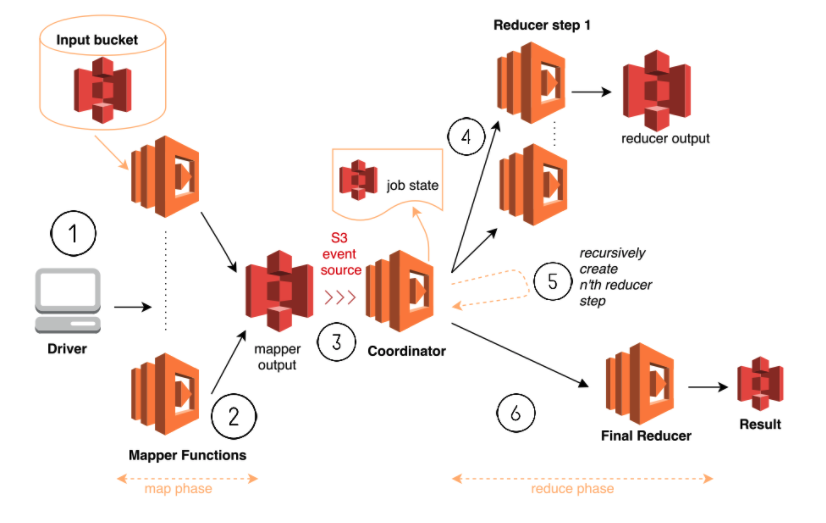
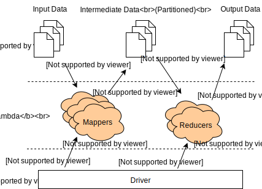
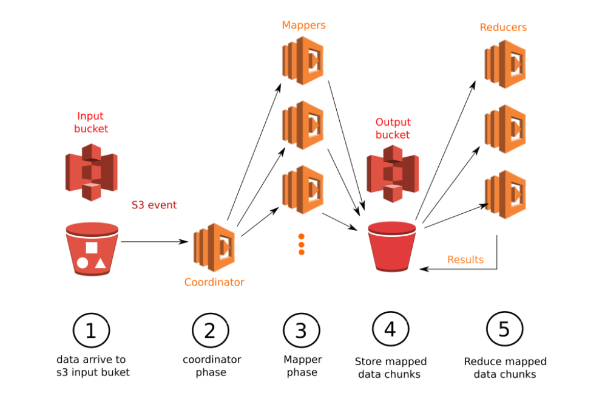
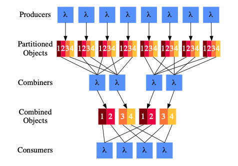

# SERVERLESS DATA PROCESSING

Paralellizing data processing has been in the roadmap of engineers trying to create more efficient processing frameworks for a long time. Allowing paralelization into frameworks requires a set of computers than can be used to process the data, it is clear to see that the management and configuration of this resources becomes a major bottleneck. Cloud providers have created solutions for this problem by introducing managed clusters that allow users to run big data applications without the need of having on-premise clusters. An example of this is Amazon EMR, a service that allows you to configure elastic clusters running on EC2 instances in a matter of minutes. However, recent research [2] has proven that serverless data processing frameworks outperform frameworks running on managed clusters. For this reason, in this section we eveluate different existing solutions for serverless data processing in the cloud. 

## AWS serveless mapreduce

The simplest of frameworks is the one provided by AWS. This framework allows the users to run ad hoc map reduce jobs using a serverless architecture using AWS Lambda and S3 as its main components. It states that the solution is cheaper and faster that existing well-known MapReduce frameworks.  

This framework is composed of a loal driver and three main Lambda functions: the mapper, reducer and coordinator. Both the mapper and reducer are functions specified by the user while the coordinator is provided by the framework. Different to other serverless MapReduce frameworks, this implementation uses the coordinator as a serverless function and saves its state data to S3. This allows the architecture to be truly serverless. 

Workflow:
1. The execution begins with the driver who is responsibleof reading the configuration file to determine the location of the mapper and reducer files as well as the input data in S3. The driver reads the input data to create batches which will be passes into the mappers. Finally the driver creates the three lambdas and it creates an S3 folder which will be used as a temporary workspace for the job. 
2. Each mapper reads from the input batch created by the driver and outputs the result of their computation into the S3 folder created for the job. Using an event-source on the S3 folder, the coordinator is invoked and sends the output of the mappers to the reducers in batches. 
3. The coordinator is notified everytime a new reduce phase finishes and initializes the next stage until there is a single reduced output. 

 
[1]

Limitations:
- From the design it is clear that this implementation will not be able to scale as the amount of data to process increases. This is caused by the absence of a shuffle stage and it means that the reducers will need to reduce through all files recursivly until there is only one left. 

## Corral

Corral is a mapreduce inspired framework designed to run in AWS Lambda. Corral offers easy to use interfaces that developers can use to sepecify how data is mapped and reduced. For its communication, it uses S3 as the mechanism to achieve stateless shuffling. 

Workflow:
1. Like hadoop's map reduce, the input data is split into similar size chunks. Each of these chunks is the input for the mappers with  a one-to-one relation. The implmenetation of the splitting algorithms tries to to put data from the same file into the same splits, however this is not a guarantee.
2. The mappers recieve the data line-by-line and perform the developer's specific map function. 
3. The mappers output is shuffled using S3. Keys are partition into n number of reducers meaning that each mapper writes up to n different S3 files. 
4. Reducers read from the S3 files generated by the mappers and start reducing the data with the developer's specified function. The output is again written to S3, where each reducer will write one output file. Because of the shuffling data, the output of each reducer is final. 

 
[5]

Limitations:
- Corral does not allow for a logical split. Treating each file as input for each mapper is not possible. A simple job where the user wants to perform a total calculation in each file will not be possible.
- There is a local driver that needs to persist for the duration of the job which means the frameworl is not completly serverless as the local machine needs to wait until the job is completed. 
- Mappers take input by line, which restricts the framework from processing data such as images.
- Given that the output of the mappers is only shufflued and not sorted, the reducers needs to be able to store all the input in memory. Note that in contrast to this, hadoop mapreduce sorts the mapper output which means the reducers can group the data as they recieve it meaning that when aggregating the date they only need to fit into memory the number of items in each group. 

## MARLA (MApReduce on Lambda)

The MARLA architecture is composed of a coordinator, mappers and reducers and uses S3 as the storage mechanism to read input data and produce the output from the mappers and reducers. 

Workflow:
1. The execution of the frameworks begins when the input data is uploaded into the input bucket. This event invokes the coordinator. It is important to notice that this framework does not use a driver running in a separate machine, instead, the mapreduce job starts with a trigger from S3, once data is submitted into the input bucket. An advantage of not using the driver is that it allows the framwork to be triggered on demand.
2. The coordinator is responsible splitting the data into chucnk size such that the data can be split into the number of mappers the user has specified. The coordinator is splits the data according to the number of mappers the user has specified and the amount of memory each memory is allowed to use. One the coordinator has defined the optimal splits, it invokes the first lambda mapper.
3. The first mapper lambda starts up and it recursively invokes the rest of the mappers. In this process, every time a new mappers starts up, they invoke a new mapper until all the mappers have been invoked.
4. Once all mappers are up and runnning, they read their respective data chunk and process the data ccording to the user's defined mapper function. Once a mapper is done processing data, the result is sorted and split into logical chunks such that all keys that start with the same letter are stored into the same chunk. Each chunk will be reduced by a different reducer. Each chunk is sent into S3 as independent files. 
5. The first reducer is invoked after the last mapper starts. This first reducer waits until the data written to the last partition is finished and then start invoking the rest of the partitioners. Each reducer will then read as many mapped chunks as it can and will process the data using the user's defined reducer function. The reducers data is finally sent into an S3 files. 

 
[6]

Failure handling:
- Coordinator: If the coordinator fails the frameworks fails to start and will need to be triggered again.
- Mapper: if a mapper fails, its data will not be uploaded to S3 and the reducers will not be invoked. The job will finish at this point however the data from the mappers that didn't fail will be stored in S3 and the user will need to handle the situation.
- Reducers: given that reducers are independent of each other, failed reducers will not produce any output data however, the rest of the reducers will output their reduced data to the output bucket. 

Limitations:
- Given that the shuffling of data depends on the first letter of the keys, if the keys are not well distributed alphabetiaclly but this can be solved if the mapper changes the key using a hash function.
- Failures are not handled gracefully. In hadoop, failures are re-executed however, if the mappers or reducers fail the frameworks finishes with incorrect data. There is no automatic re-execution strategy. 
- Data in each mapper needs to fit into memory as the results of the mapper is sorted before sending to the reducers

## Lambada

Lambada uses S3 for large data, dynamo DB for small data in the shape of key-value pairs and SQS is used for short messages. 
- All communication is done by external storage.
Architecture:
- The driver runs in the local machine of the developer/analyst
- It then invokes a fleet of workers running on AWS lambda. These workers are responsible of executing the query in parallel.
- Similar to MARLA, lambada invokes lambda workers in a recursive way in order to efficiently invoke all the desired workers. Given that the lambdas can take up to 0.5 seconds to initialize, starting 1000 lambdas could take up to 500 seconds if executed sequentially. Clearly multi-threading the requests can reduce this number significantly but there is still an overhead when invoking the workers. To solve this, Lambada offloads this to the first workers by passing a list of ids and input data. Once the workers recieve this data, they start they invoke workers for each item in the list before executing their processing function. According to Lambada this mechanism enabled the framework to invoke 4096 workers in 2.5 seconds from the initial 13 to 18 seconds. (As a note for me, the driver and the first-level workers execute the same amount of workers)  

## PyWren 

PyWren is an Python API that allows programmers to parallelize embrassingly parallelizable jobs. 

- For the lamdas functions, there is a common function that then pulls the code needed to run from S3 using cloudpickle. 

- PyWren integrates with existing libraries for data processing and visualization
Modes:
- Map+monolitic reduce (the aggregated values are stored in a single reducer) This is useful whith compute intensive application that do not generate many features. 
- MapReduce: shuffle is an important design consiferation to achieve fast mapreduce frameworks. PyWren uses S3 as its mechanism to implement shuffles. The shuffle is achieved in two steps: A partition stage that partitions input data into n partitions and a merge stage that for each partition merges the data and sorts it. Given the limitations of lambda, PyWren needs many workers to achieve the shuffle. For 1 TB of data it requires to shuffle around 6 million files and while S3 has a high I/O throughput, it falls short. As a solution, PyWren uses a Redis cluster for the intermediate storage and keeps S3 for the input and output. However, this Redis cluster becomes a bottleneck if not configured correctly. Another limitation of this is the fact that a Redis cluster is charged per hour, which in a way makes PyWren to be similar to a managed cluster service where you pay by the hour rather than exlusivly for what you use.  

## Starling

Startling is a serverless query execution engine. 

Execution:
Queries are submited by the users to the coordinator who is responsible of compiling the query and uploading it to the cloud function service. The function service provisions the workers that perform the query tasks, these invokations are invoked at once in parallel from a cold start. These workers read and write data (both intermediate and final output) from cloud object storage services. Once workers are done, the query result is returned to the user. 

- The coordinator runs in a smalle VM, which means the framework is not entirely serverles.
- Uses AWS Lambda

Shuffling data:
- The perfect medium of communication between workers to achieve the shuffle mechanism should be low cost, high trhoughput, low latency, and scale transparently
- Starling argues against AWS Kinesis, as this involves the framework or users to prevision capacity ahead of execution. SQS becomes computationally expensive for large shuffles. And Dynamo DB has low latency but it becomes very expesive for large shuffles. Hence, Sterling decided to use S3 as the medium for inter communication between workers. 
- Workers write output to S3 as a single object with a predetermined key. Having a pre-determined key means that readers can poll the object until it exists. 
- A single partitioned file is written to S3 and each consumer task reads only the relevant portions of each object output by the producers. 
- Each producer writes a single object that contains all partitions. This is done to minimize write costs. And each consumer reads only the relevant part of each of these objects. This is possible using S3 read with offset functionality. Consumers determine which part of the file to read using by using the metadata written by the producer at the start of the file. This means that a consumer needs 2 reads per object, one for the metadata and the second for the actual data. 
- (just as a note) To mitigate read-after-write inconsistencies, Sterling uses a "doublewrite" technique which involes write the worker ouput twice to two different objects so that consumers that can't find the data in the first object they can try to read from the second object. 
- Given that workers are small many small sized objects can be written. This is a concern prize wise when a lot of workers are required. To solve this issue, Starling introduces a combiner stage. Each combiner worker reads a contiguous subset of the partition from a subset of the partitions and produce a single combined output. 

 
[TODO]

## Flint

Flint is a serverless framework that allows users to run processing jobs using PySpark without the need of a Spark cluster. The framework is entirley pay-as-you-go model as it relies on AWS Lambda, S3, and SQS. AWS Lambda is used to execute Spark tasks, the input and output are stored in S3, and SQS is used to shuffle data. 

- The executors run in AWS Lambda, each lambda process one task
- When a Flint executor is initialized, it creates an input iterator to read from the input partition assigned to it. This iterator reads from S3 for the first plan, however, Flint relies on SQS as the input for the following stages. 
- Similar to MapReduce, when a task is completed, the outputdata of an intermediate stage needs to be shuffled to ensure all values of a key are place in the same partition. Given that the Lambdas functions have a time limit, Flint cannot guarantee this output is passed to the executors running tasks in the next stage. To overcome this, Flint uses SQS. 
- Executor's output is partitioned using the hash partition function specified. The executor tries to batch the output in memory but once it becomes large to be in memory it flushes the output into SQS as a batch of messages. Once the output has all been flushed the executor returns diagnostic SQS data.
- The next set of executors read data from SQS and aggreagate the data in memory. To avoid overflowing the memory, Flint increases the number of partitions (SQS queues).

Intresting solutions:
- To work around the time limit lambda functions have, Flint stops the execution of lambdas when a time limit is soon to be reached. Before this it saves its state by sending it back to the sheduler. The scheduler then uses this information to start a new lambda to start right from where the other lambda stop. 

3. Cloud map reduce: A MapReduce Implementation on top of a Cloud Operating System  

4. Evaluating serverless data processing frameworks

Similitudes:
- Driver: where does the driver live and how does it communicate with the rest of the resouces. Synch communiction to keep track of resources means that the driver must persist for the duration of the job. This brings up two probles, first it means that the platfrom depends on the driver running for the duration of the job and this makes the framework not entirely serverless. In the other side, if the framework runs in a serverless function then it means the framework is restricted to the maximum amount of time the functino can run for (AWS has a 15 min max). 

- All frameworks use FAAS

- Communication: serverless functions do not have a natural way of communicating with each other, and given their stateless nature, a work around is used by all frameworks. Corral uses s3, and it creates a folder for each key it encountersso that the reducers only need to look at one forder (shuffling step done). PyWren rellies on the programmer to define the shuffling step (given that we want this framework to be as simple as possible we avoid doing that). It is important to notice that given that we depend on external services, extra care should be taken to make sure each of the resources can scale up as desired to avoid having a bottleneck anywhere in the system. Quobole relies on a single VM for inter-process comuniction which becomes a bottleneck for big datasets.

## Resources:
1. https://aws.amazon.com/blogs/compute/ad-hoc-big-data-processing-made-simple-with-serverless-mapreduce/  
2. https://www.ise.tu-berlin.de/fileadmin/fg308/publications/2020/PrePrint_2020__WoSC_Eval_SDPF.pdf
3. https://citeseerx.ist.psu.edu/viewdoc/download?doi=10.1.1.177.4059&rep=rep1&type=pdf 
4. https://github.com/bcongdon/corral
5. https://benjamincongdon.me/blog/2018/05/02/Introducing-Corral-A-Serverless-MapReduce-Framework/
6. MARLA Vicent Giménez-Alventosa, Germán Moltó, and Miguel Caballer. 2019.
A framework and a performance assessment for serverless MapReduce
on AWS Lambda. Future Generation Computer Systems 97 (2019), 
- https://aws.amazon.com/emr/features/?nc=sn&loc=2&dn=1 AMAZON EMR Features
- TODO: add lambada pdf
- TODO: pyWren paper
- TODO: add Starling paper
- TODOL add flint paper